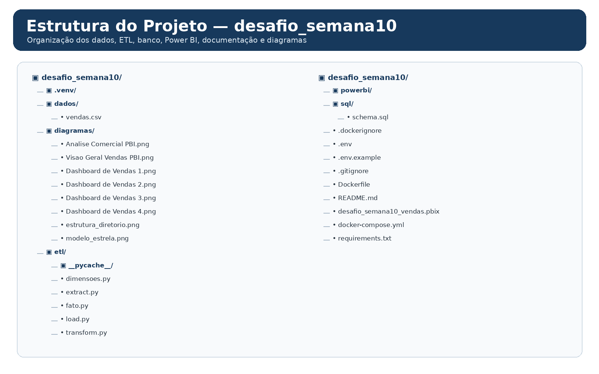
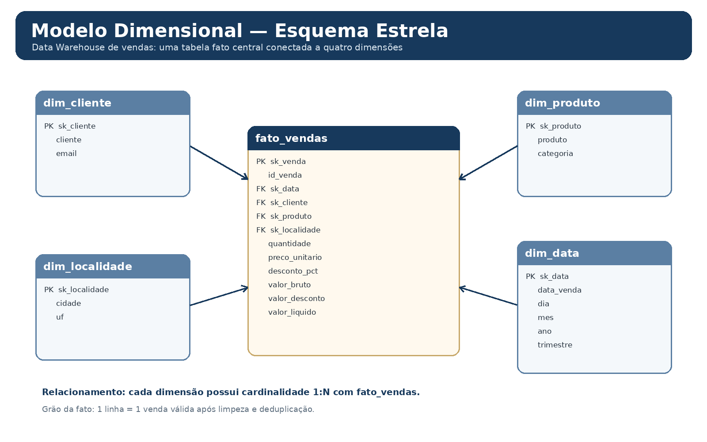

# Desafio Semana 10 — Pipeline ETL, PostgreSQL e Power BI

> Projeto acadêmico desenvolvido no **SCTEC — Análise de Dados, Módulo II, Semana 10**.  
> O objetivo foi construir um fluxo completo de dados, desde a leitura de um arquivo CSV até a disponibilização das informações em um **Data Warehouse PostgreSQL** e a criação de dashboards no **Power BI**.

---

## 1. Objetivo do projeto

O projeto utiliza o arquivo `dados/vendas.csv` como fonte de dados e implementa um pipeline de **ETL (Extract, Transform, Load)** em Python/Pandas.

O fluxo desenvolvido foi:

```text
vendas.csv
   │
   ▼
Extração — extract.py
   │
   ▼
Transformação e limpeza — transform.py
   │
   ├──► Dimensões — dimensoes.py
   │
   └──► Tabela fato — fato.py
   │
   ▼
Carga — load.py
   │
   ▼
PostgreSQL — vendas_dw
   │
   ▼
Power BI
   │
   ▼
Dashboards e análise comercial
```

Além da implementação técnica, o projeto também contempla documentação, validação dos dados, visualização no Power BI e estudos alternativos de layout.

---

## 2. Estrutura do projeto

A organização do repositório separa dados, scripts do pipeline, SQL, arquivos do Power BI e imagens de documentação.

<p align="center">
  
</p>

```text
desafio_semana10/
│
├── .venv/
├── dados/
│   └── vendas.csv
│
├── diagramas/
│   ├── Analise Comercial PBI.png
│   ├── Visao Geral Vendas PBI.png
│   ├── Dashboard de Vendas 1.png
│   ├── Dashboard de Vendas 2.png
│   ├── Dashboard de Vendas 3.png
│   ├── Dashboard de Vendas 4.png
│   ├── estrutura_diretorio.png
│   └── modelo_estrela.png
│
├── etl/
│   ├── __pycache__/
│   ├── dimensoes.py
│   ├── extract.py
│   ├── fato.py
│   ├── load.py
│   └── transform.py
│
├── powerbi/
├── sql/
│   └── schema.sql
│
├── .dockerignore
├── .env
├── .env.example
├── .gitignore
├── Dockerfile
├── README.md
├── desafio_semana10_vendas.pbix
├── docker-compose.yml
└── requirements.txt
```

### Principais responsabilidades

| Arquivo / pasta | Responsabilidade |
|---|---|
| `dados/vendas.csv` | Fonte de dados bruta utilizada pelo pipeline |
| `etl/extract.py` | Leitura e extração dos dados do CSV |
| `etl/transform.py` | Limpeza, padronização, conversão de tipos e criação das métricas |
| `etl/dimensoes.py` | Construção das tabelas dimensão |
| `etl/fato.py` | Construção da tabela fato |
| `etl/load.py` | Orquestração da carga das tabelas no PostgreSQL |
| `sql/schema.sql` | Criação da estrutura do Data Warehouse no PostgreSQL |
| `docker-compose.yml` | Subida do ambiente com PostgreSQL e execução do pipeline |
| `desafio_semana10_vendas.pbix` | Arquivo do Power BI |
| `diagramas/` | Prints do Power BI, propostas alternativas e diagramas do projeto |

---

## 3. Base de dados de origem

O arquivo original `vendas.csv` possuía:

- **305 linhas**
- **11 colunas**

Colunas da origem:

```text
id_venda
data_venda
cliente
email
cidade
uf
produto
categoria
quantidade
preco_unitario
desconto_pct
```

Cada registro representa uma venda com informações de cliente, localização, produto, quantidade, preço e desconto.

---

## 4. Pipeline ETL

### 4.1 Extract — Extração

O módulo `extract.py` é responsável por ler o arquivo:

```text
dados/vendas.csv
```

Nesta etapa os dados ainda representam a origem bruta, antes da aplicação das regras de qualidade.

---

### 4.2 Transform — Transformação

A etapa de transformação realiza a limpeza e padronização dos dados antes da modelagem dimensional.

Entre os tratamentos realizados estão:

- remoção de **5 registros duplicados**, identificados pelos IDs:
  - `1010`
  - `1129`
  - `1157`
  - `1166`
  - `1278`
- preenchimento de **32 descontos nulos com 0**;
- padronização das categorias;
- padronização das UFs;
- conversão da coluna `data_venda` para tipo de data;
- conversão de `preco_unitario` para valor numérico;
- cálculo das métricas financeiras.

Após a limpeza:

```text
305 registros originais
- 5 duplicados
----------------
300 vendas válidas
```

### Métricas calculadas

Para cada venda são produzidas as seguintes métricas:

```text
valor_bruto     = quantidade × preco_unitario
valor_desconto  = valor_bruto × desconto_pct
valor_liquido   = valor_bruto - valor_desconto
```

---

## 5. Modelagem dimensional

Os dados tratados são organizados em um **Star Schema (Esquema Estrela)**.

A tabela `fato_vendas` concentra as métricas e as chaves estrangeiras. As informações descritivas são armazenadas em quatro dimensões.

<p align="center">
  
</p>

### 5.1 `dim_cliente`

| Campo | Descrição |
|---|---|
| `sk_cliente` | chave substituta da dimensão |
| `cliente` | nome do cliente |
| `email` | e-mail do cliente |

Quantidade carregada:

```text
89 clientes
```

### 5.2 `dim_produto`

| Campo | Descrição |
|---|---|
| `sk_produto` | chave substituta da dimensão |
| `produto` | nome do produto |
| `categoria` | categoria comercial |

Quantidade carregada:

```text
13 produtos
```

### 5.3 `dim_localidade`

| Campo | Descrição |
|---|---|
| `sk_localidade` | chave substituta |
| `cidade` | cidade |
| `uf` | unidade federativa |

Quantidade carregada:

```text
20 localidades
```

### 5.4 `dim_data`

| Campo | Descrição |
|---|---|
| `sk_data` | chave substituta |
| `data_venda` | data da venda |
| `dia` | dia |
| `mes` | mês |
| `ano` | ano |
| `trimestre` | trimestre |

Quantidade carregada:

```text
131 datas
```

### 5.5 `fato_vendas`

A tabela fato possui:

```text
sk_venda
id_venda
sk_data
sk_cliente
sk_produto
sk_localidade
quantidade
preco_unitario
desconto_pct
valor_bruto
valor_desconto
valor_liquido
```

O grão da tabela fato é:

> **1 linha em `fato_vendas` = 1 venda válida após a limpeza do arquivo de origem.**

Quantidade carregada:

```text
300 vendas
```

---

## 6. Carga no PostgreSQL

O script `load.py` executa o fluxo do pipeline, cria os DataFrames das dimensões e da fato e realiza a carga no PostgreSQL.

O banco utilizado no projeto é:

```text
vendas_dw
```

No Docker, o serviço do PostgreSQL utiliza internamente a porta:

```text
5432
```

A porta disponibilizada no computador hospedeiro é:

```text
localhost:5434
```

O `schema.sql` é responsável pela estrutura das tabelas:

```text
dim_cliente
dim_produto
dim_localidade
dim_data
fato_vendas
```

Os relacionamentos são realizados pelas chaves substitutas das dimensões.

---

## 7. Docker

O projeto utiliza Docker para tornar o ambiente reproduzível e manter o PostgreSQL isolado.

### Construção e execução

```bash
docker compose up --build
```

Para executar em segundo plano:

```bash
docker compose up -d
```

Para acompanhar os containers:

```bash
docker compose ps
```

Para visualizar os logs:

```bash
docker compose logs
```

Para encerrar:

```bash
docker compose down
```

### Variáveis de ambiente

As credenciais e configurações do banco são fornecidas por variáveis de ambiente.

O arquivo real:

```text
.env
```

não deve ser enviado ao GitHub.

O repositório utiliza:

```text
.env.example
.gitignore
```

para documentar as variáveis necessárias sem publicar credenciais.

---

## 8. Validação da carga

Após a execução do pipeline, foram obtidos os seguintes resultados:

| Tabela / medida | Resultado |
|---|---:|
| Registros originais | 305 |
| Vendas válidas | 300 |
| Itens vendidos | 602 |
| `dim_cliente` | 89 |
| `dim_produto` | 13 |
| `dim_localidade` | 20 |
| `dim_data` | 131 |
| `fato_vendas` | 300 |
| Valor bruto | R$ 498.954,80 |
| Valor de descontos | R$ 27.570,28 |
| Faturamento líquido | **R$ 471.384,71** |

Os três totais financeiros foram conferidos após a carga no PostgreSQL. O faturamento líquido validado no projeto é de **R$ 471.384,71**, calculado a partir das métricas produzidas pelo pipeline em cada venda.

---

## 9. Power BI

Após a carga no PostgreSQL, o Power BI foi conectado ao Data Warehouse.

Configuração utilizada:

```text
Servidor: localhost:5434
Banco: vendas_dw
Modo: Importar
```

Foram carregadas as cinco tabelas:

```text
dim_cliente
dim_produto
dim_localidade
dim_data
fato_vendas
```

Os relacionamentos foram configurados no modelo com cardinalidade:

```text
dimensão 1 : N fato_vendas
```

A partir desse modelo foram construídas as análises comerciais.

---

# 10. Dashboards desenvolvidos no Power BI

As duas imagens abaixo são **prints do dashboard efetivamente desenvolvido no Power BI**.

## 10.1 Visão Geral — Power BI

<p align="center">
  
</p>

Essa página apresenta uma visão executiva do período, incluindo indicadores como:

- faturamento líquido;
- ticket médio;
- quantidade de vendas;
- itens vendidos;
- faturamento por categoria;
- faturamento por UF;
- faturamento por mês;
- faturamento por produto;
- faturamento por cidade.

---

## 10.2 Análise Comercial — Power BI

<p align="center">
  
</p>

A segunda página aprofunda a análise por:

- produtos;
- quantidade vendida;
- clientes;
- categorias;
- descontos;
- ticket médio.

> Estas duas imagens representam a **versão principal do projeto**, construída no Power BI.

---

# 11. Propostas alternativas de visualização

Além dos dashboards criados no Power BI, foram produzidas quatro propostas visuais alternativas.

Essas imagens foram elaboradas como **estudo de design e organização das informações**, com o objetivo de:

- reduzir a poluição visual;
- aumentar o espaço em branco;
- melhorar a hierarquia das informações;
- separar assuntos diferentes em páginas específicas;
- facilitar a leitura dos gráficos.

Elas **não substituem** o dashboard desenvolvido no Power BI.

## 11.1 Alternativa 1 — Visão Geral

<p align="center">
  
</p>

---

## 11.2 Alternativa 2 — Produtos e Categorias

<p align="center">
  
</p>

---

## 11.3 Alternativa 3 — Clientes

<p align="center">
  
</p>

---

## 11.4 Alternativa 4 — Localidades

<p align="center">
  
</p>

---

## 12. Principais resultados comerciais

A análise do período de **janeiro a junho de 2026** apresenta como indicadores principais:

```text
Faturamento líquido: R$ 471,38 mil
Ticket médio:         R$ 1,57 mil
Quantidade de vendas: 300
Itens vendidos:       602
```

### Faturamento por categoria

| Categoria | Faturamento líquido |
|---|---:|
| Informática | R$ 180,5 mil |
| Eletrônicos | R$ 158,3 mil |
| Móveis | R$ 122,6 mil |

### Faturamento por UF

| UF | Faturamento líquido |
|---|---:|
| SC | R$ 186,4 mil |
| PR | R$ 151,2 mil |
| RS | R$ 133,8 mil |

### Top 3 cidades

| Cidade | Faturamento |
|---|---:|
| Porto Alegre | R$ 56,8 mil |
| Curitiba | R$ 54,1 mil |
| Joinville | R$ 33,7 mil |

---

## 13. Tecnologias utilizadas

| Tecnologia | Uso no projeto |
|---|---|
| Python | desenvolvimento do pipeline |
| Pandas | extração, transformação e modelagem dos dados |
| PostgreSQL | armazenamento do Data Warehouse |
| SQL | criação da estrutura e consultas |
| Docker | padronização do ambiente |
| Docker Compose | execução integrada dos serviços |
| Power BI | modelagem analítica e dashboards |
| Git | controle de versão |
| GitHub | publicação do projeto |
| VS Code | desenvolvimento dos scripts |

---

## 14. Como reproduzir o projeto

### 1. Clonar o repositório

```bash
git clone https://github.com/Rangel-Floripa/SCTEC_Desafio_Semana_10.git
cd desafio_semana10
```

### 2. Criar o `.env`

Use o arquivo de exemplo como referência:

```bash
copy .env.example .env
```

No Linux/macOS:

```bash
cp .env.example .env
```

Preencha as configurações locais do PostgreSQL sem publicar senhas no repositório.

### 3. Subir o ambiente

```bash
docker compose up --build
```

### 4. Conferir a execução

```bash
docker compose ps
docker compose logs
```

### 5. Abrir o Power BI

Abra:

```text
desafio_semana10_vendas.pbix
```

Caso necessário, atualize a fonte apontando para:

```text
localhost:5434
```

Banco:

```text
vendas_dw
```

---

## 15. Segurança e boas práticas

O projeto foi estruturado para não publicar credenciais.

Arquivos sensíveis devem permanecer fora do Git:

```text
.env
.venv/
__pycache__/
```

O arquivo:

```text
.env.example
```

deve conter apenas nomes das variáveis e valores de exemplo, nunca senhas reais.

---

## 16. Resultado final

O projeto percorre um fluxo completo de Engenharia e Análise de Dados:

```text
CSV
↓
Python / Pandas
↓
Limpeza e transformação
↓
Modelagem dimensional
↓
PostgreSQL
↓
Docker
↓
Power BI
↓
Dashboard e análise comercial
```

Dessa forma, os dados brutos do arquivo `vendas.csv` foram transformados em um modelo analítico estruturado, validado e utilizado para a construção de dashboards capazes de apoiar a interpretação do desempenho de vendas.

---

## 17. Contexto acadêmico

Projeto desenvolvido como atividade do **SCTEC — Análise de Dados, Módulo II, Semana 10**, integrando conhecimentos de:

- ETL;
- Python/Pandas;
- modelagem dimensional;
- Star Schema;
- PostgreSQL;
- Docker;
- Power BI;
- visualização de dados;
- Git e GitHub.
